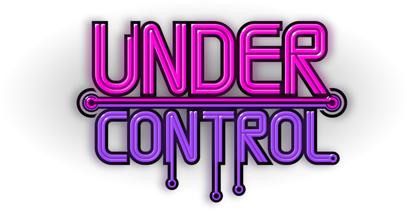

Under Control is a local multiplayer platform game where up to 4 players fight with grenades to beat each other.

This project is made by me, [sebaenam](https://github.com/sebaenam) on programming and design, Gustavo Santome on art and Lautaro Dichio on music and sfx. The game is open source, created with Unity and powered by Wwise. I have also used InControl plugin to manage inputs and fonts were created by Tugcu Design Co.

Checkout the game on itch.io: https://lqngames.itch.io/under-control

Link to Trello: https://trello.com/b/hRkLZFY2/under-control
